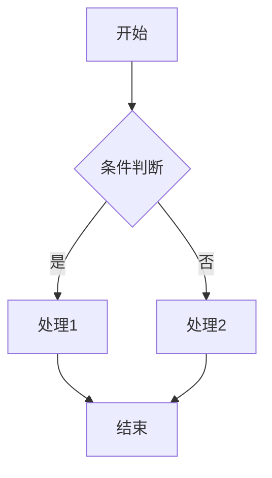
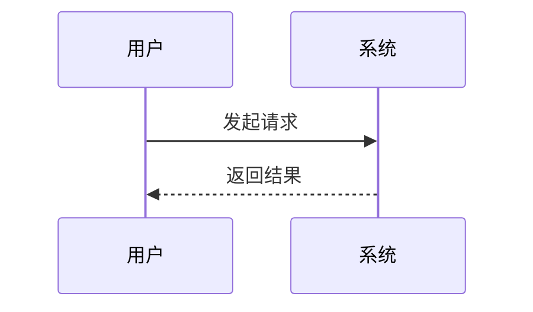
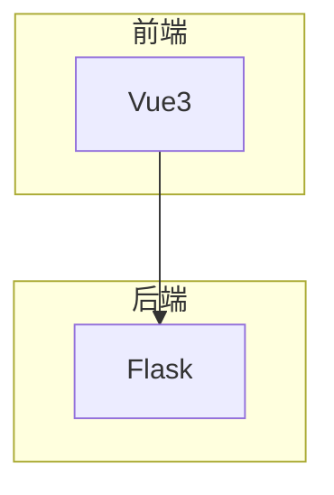
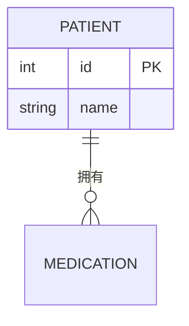
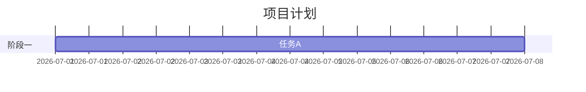
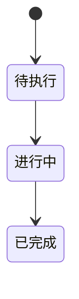
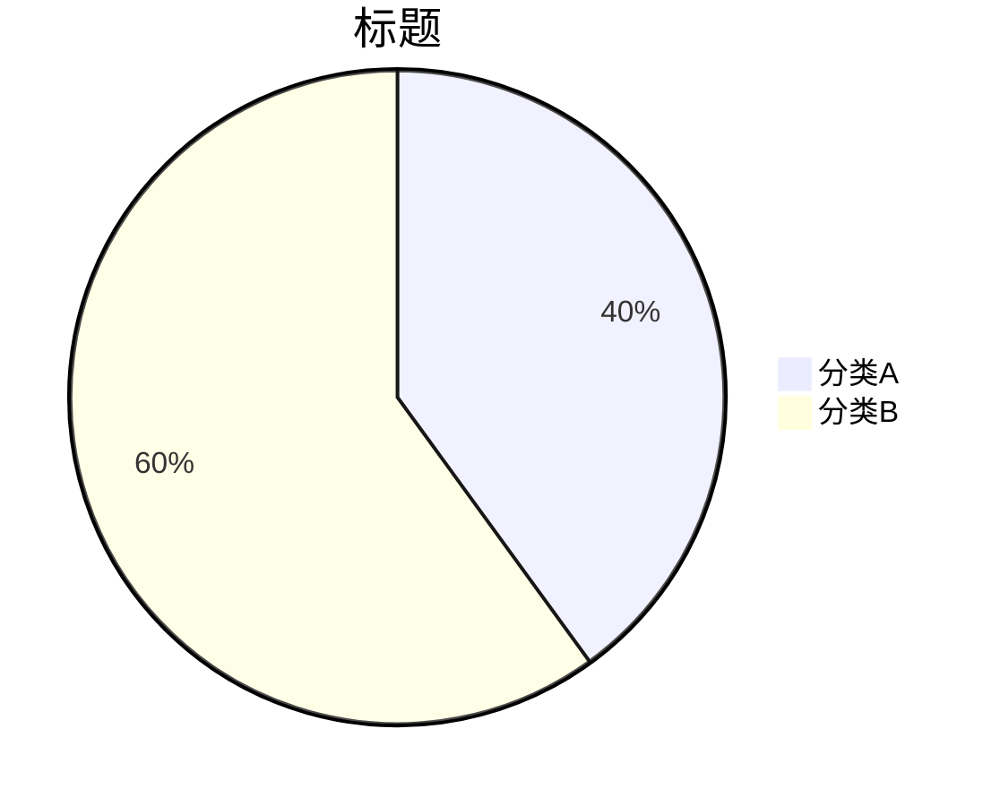

# Mermaid 图表技能

用 Mermaid 文本语法生成图表，输出可直接渲染的 mermaid 代码块。

## 使用方式

根据用户需求选择合适的图表类型，输出标准的 ```mermaid 代码块。语法必须严格正确，避免渲染失败。

## 图表类型与语法要点

### 1. 流程图 (flowchart)

- 方向：`TD`(上到下) `LR`(左到右) `BT` `RL`
- 节点：`[矩形]` `(圆角)` `{菱形}` `((圆形))`
- 连线：`-->` `---` `-.->` `==>`，可带标签 `-->|文字|`

### 2. 时序图 (sequenceDiagram)

- `->>` 实线箭头，`-->>` 虚线返回
- 支持 `activate/deactivate`、`Note`、`loop`、`alt/else`

### 3. 架构图
用 flowchart + subgraph 分层：


### 4. ER图 (erDiagram)


### 5. 甘特图 (gantt)


### 6. 状态图 (stateDiagram-v2)


### 7. 饼图 (pie)


## 输出要求

1. 只输出可渲染的 mermaid 代码块，语法严格校验。
2. 节点文字含特殊字符（括号、引号、冒号）时用引号包裹：`A["文字(含括号)"]`。
3. 中文标签正常使用，无需转义。
4. 复杂图表适当拆分，避免单图过于密集。
5. 默认给出简短说明 + 代码块，不要冗余解释。
